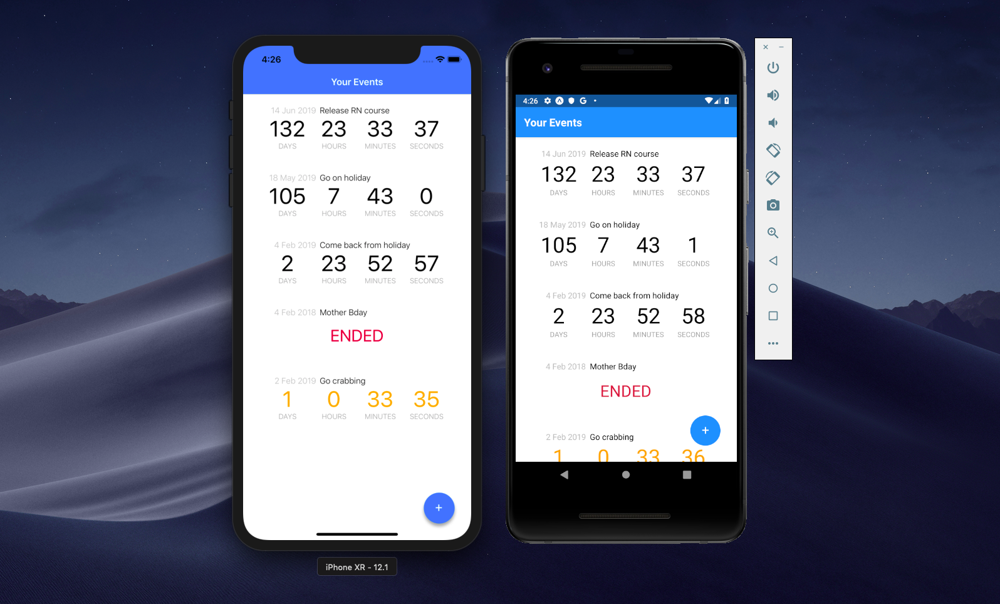
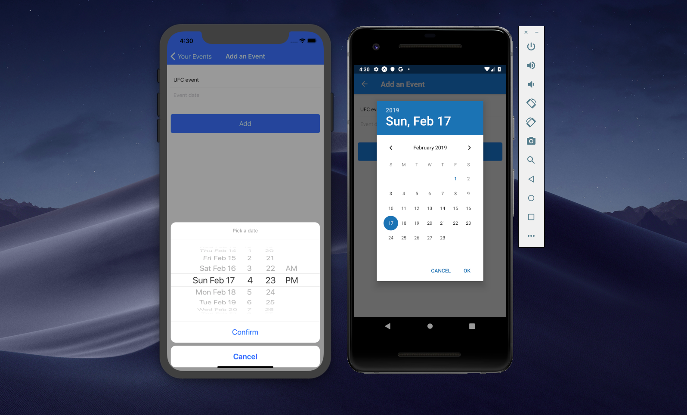

# React Native Boot Camp Training Day 1 - Expo project

#Event organizer React Native app using CRUD operation (create, read, update, delete) and HTTP client.
#npm start will concurrently run json-server and expo.

